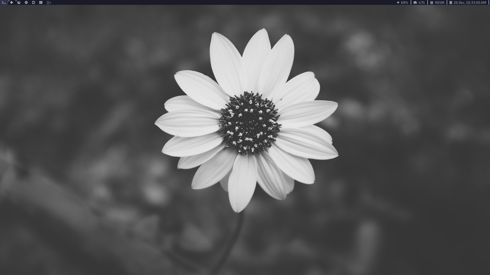
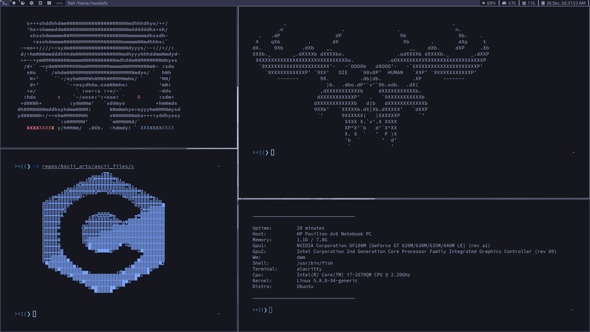
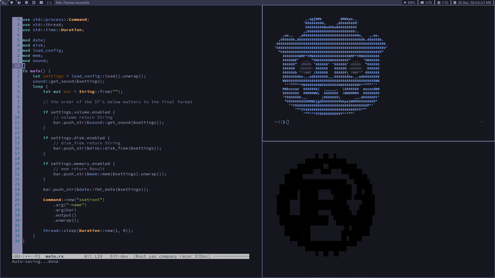

# mustafa's build of dwm
My build of dwm window manager

## Status bar
[rsblocks](https://github.com/MustafaSalih1993/rsblocks)

## Screenshots

	

 

	

 

	

 

## Patches
All the patches included in the `patchs` folder.

* [dwm-fibonacci](https://dwm.suckless.org/patches/fibonacci/) This patch adds 2 new layouts (`spiral` and `dwindle`).
* [dwm-status2d](https://dwm.suckless.org/patches/status2d/) This patch allow colors and rectangle drawing in the status bar.
